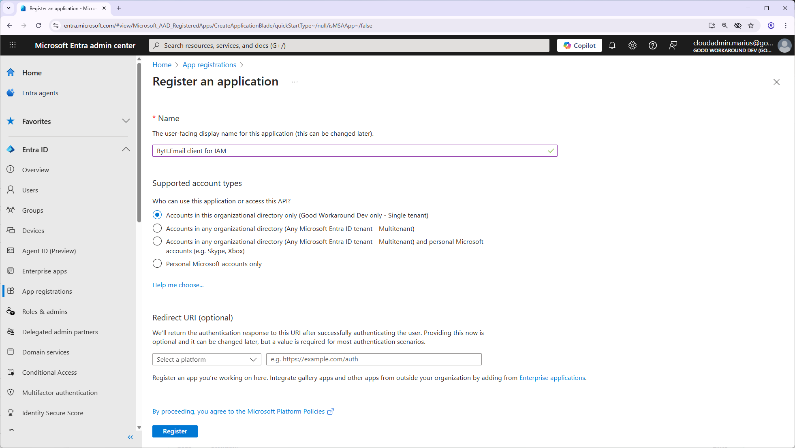
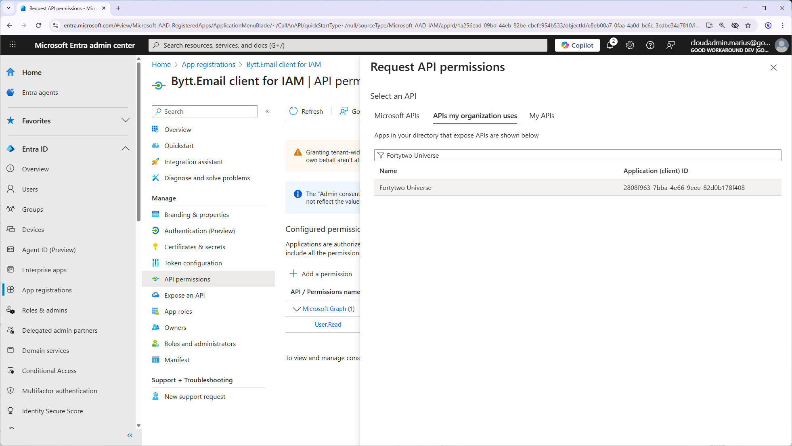
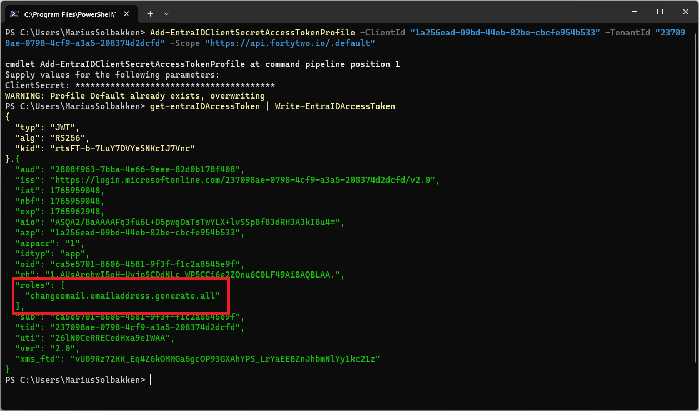
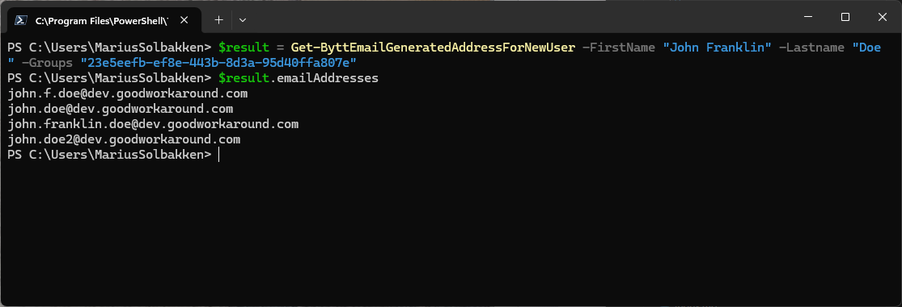

# Using the API in your automations

You can easily use the [API](https://api.fortytwo.io/changeemail/swagger/index.html) in your automations, such as for user provisioning of new employee accounts. For this purpose, we have the endpoint ```https://api.fortytwo.io/changeemail/emailaddresses/generatenewuser``` and the PowerShell cmdlet ```Get-ByttEmailGeneratedAddressForNewUser```.

These can be used by applications assigned a scope in Entra ID, or by users with the [Bytt.Email - Administrator role](./roles.md).

This example will use PowerShell, and authentication using an Entra ID app, but can easily be used by other systems.

## Create app with access to the API

1. Create a new application registration in Entra ID
    - Open [the Entra admin center](https://entra.microsoft.com)
    - Find **App registrations** in the left menu and click **+ New registration**
    - Name your application something that makes sense to you and click **Register**



2. Create credential for the app (Example using client secret)
    - Note down **client id** and **tenant id**
    - Under **Certificates and secrets**, create a **client secret**


3. Add API permissions for the Bytt.Email API
    - Go to **API Permissions** and click **+ Add a permission**
    - Choose **APIs my organization uses** and find **Fortytwo Universe**
    - Under **Application permissions**, choose **changeemail.emailaddress.generate.all** and click **Add permissions**




4. Grant admin consent


## Example 1 - PowerShell

**Add authentication:**

Authentication is simplified with the [EntraIDAccessToken](https://www.powershellgallery.com/packages/EntraIDAccessToken) module.

```PowerShell
Install-Module EntraIDAccessToken -Scope CurrentUser
Add-EntraIDClientSecretAccessTokenProfile -ClientId "1a256ead-09bd-44eb-82be-cbcfe954b533" -TenantId "237098ae-0798-4cf9-a3a5-208374d2dcfd" -Scope "https://api.fortytwo.io/.default"
Get-entraIDAccessToken | Write-EntraIDAccessToken
```

After running this, you should get an access token with the correct roles:



**Request Bytt.Email to generate email addresses:**

In order to generate email addresses for a new user, only by providing firstname and lastname, we also need to provide which group memberships will be used for the pattern groups, as described [here](./config-step2.md). This is because the service relies on groups in Entra ID, and the user is not yet a member of a group. In practice, if you have multiple companies or other reasons to have multiple email pattern groups, you will need to do some calculation on which group memberships should be used before requesting the API to generate.

```PowerShell
Connect-ByttEmail -EntraIDAccessTokenProfile Default
$result = Get-ByttEmailGeneratedAddressForNewUser -FirstName "John Franklin" -Lastname "Doe" -Groups "4cb1364b-d153-495e-8bb5-2d7108fd1415"
$result.emailAddresses
```



## Example 2 - Raw HTTP requests

**Get access token from Entra ID:**

```HTTP
POST https://login.microsoftonline.com/237098ae-0798-4cf9-a3a5-208374d2dcfd/oauth2/v2.0/token
Content-Type: application/x-www-form-urlencoded

client_id=1a256ead-09bd-44eb-82be-cbcfe954b533&client_secret...&scope=https://api.fortytwo.io/.default&grant_type=client_credentials
```

**Request the API to generate email addresses:**

In order to generate email addresses for a new user, only by providing firstname and lastname, we also need to provide which group memberships will be used for the pattern groups, as described [here](./config-step2.md). This is because the service relies on groups in Entra ID, and the user is not yet a member of a group. In practice, if you have multiple companies or other reasons to have multiple email pattern groups, you will need to do some calculation on which group memberships should be used before requesting the API to generate.

```HTTP
POST https://api.fortytwo.io/changeemail/emailaddresses/generatenewuser
Content-Type: application/json
Authorization: Bearer --TOKEN--

{
  "groupMemberships": [
    "4cb1364b-d153-495e-8bb5-2d7108fd1415"
  ],
  "lastname": "Doe",
  "firstname": "John Franklin"
}
```