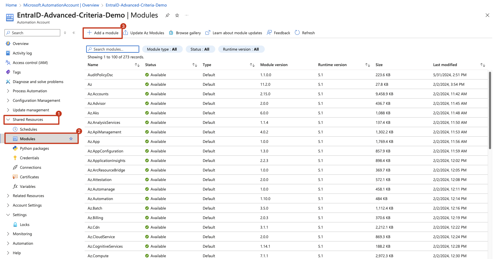
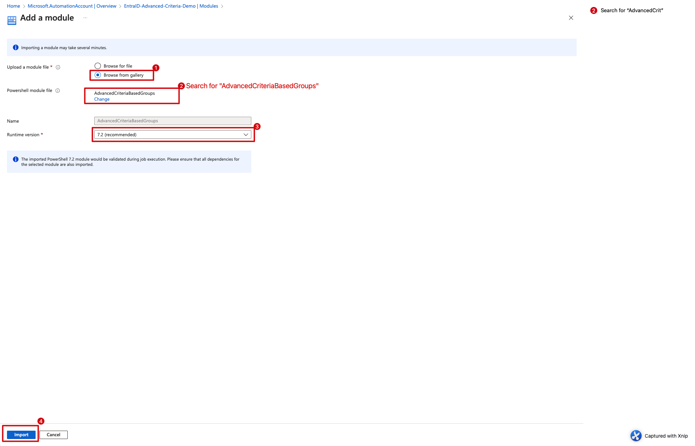
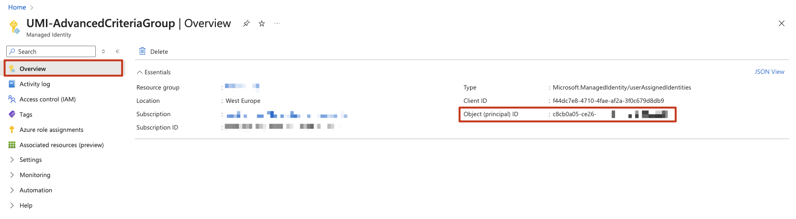
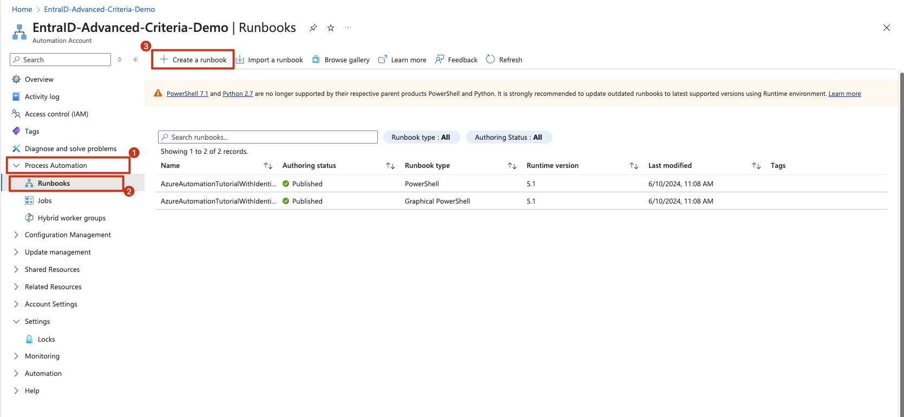
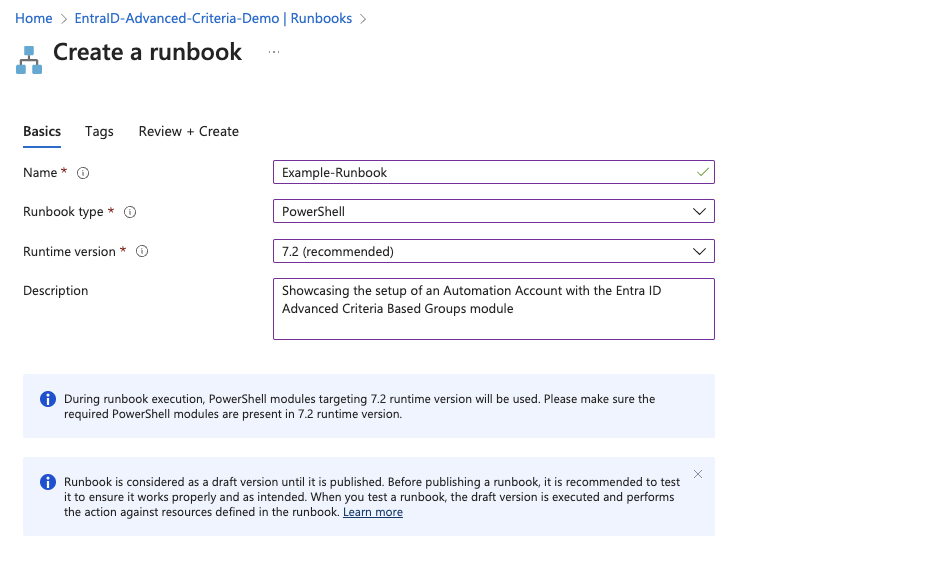

# Use module with an Automation Account

By using our dynamic group module with an Azure Automation Account, you can easily automate and schedule advanced group memberships in a manner that is currently unsupported by the built in dynamic/criteria based groups.

## Prerequisites:
- A working Azure Subscription
- Account with Global Administrator permissions
- Group(s) that you want the module to administer
- (Optional) API endpoints for actions to be taken when adding/removing users from groups

## Configuration

### 1.1 Create Automation Account and import module
1. Create an [Automation Account](https://portal.azure.com/#view/Microsoft_Azure_Marketplace/GalleryItemDetailsBladeNopdl/id/Microsoft.AutomationAccount/selectionMode~/false/resourceGroupId//resourceGroupLocation//dontDiscardJourney~/false/selectedMenuId/home/launchingContext~/%7B%22galleryItemId%22%3A%22Microsoft.AutomationAccount%22%2C%22source%22%3A%5B%22GalleryFeaturedMenuItemPart%22%2C%22VirtualizedTileDetails%22%5D%2C%22menuItemId%22%3A%22home%22%2C%22subMenuItemId%22%3A%22Search%20results%22%2C%22telemetryId%22%3A%2228a4601a-df08-4659-90c5-ad3e4ae01f3b%22%7D/searchTelemetryId/c0ffb27e-c859-42b8-b54e-3ab33d7426d6) from the Azure Marketplace and deploy it to your designated subscription/resource group.
2. Go to *Shared Resources* -> *Modules* -> *Add module*

3. Do the following:  
Select *"Browse from gallery"*  
Click the link named *"Click here to browse from gallery"*, search for *"AdvancedCriteriaBasedGroups"*, and click *Select*.  
Use *Runtime version* 7.2.  
Click on *"Import"*


The module should now be loaded in your Automation Account.

---

### 1.2 (If not using Marketplace offer?) Create a User Assigned Managed Identity

❗️ **IMPORTANT:** This step requires an account with *Global Administrator* 

If you are configuring this yourself, you need to create a [User Assigned Managed Identity](https://learn.microsoft.com/en-us/entra/identity/managed-identities-azure-resources/how-manage-user-assigned-managed-identities?pivots=identity-mi-methods-azp) that has the permissions required for the module to run. The permissions are the following:
- **Owner** permissions on groups that the module will administer
- User.Read.All OR User.ReadWrite.All
- (Optional, depending on use) Group.ReadWrite.All


#### 1.2.1 Create a User Assigned Managed Identity and assign it:

1. Find [User Assigned Managed Identity](https://portal.azure.com/#view/Microsoft_Azure_Marketplace/GalleryItemDetailsBladeNopdl/id/Microsoft.ManagedIdentity/selectionMode~/false/resourceGroupId//resourceGroupLocation//dontDiscardJourney~/false/selectedMenuId/home/launchingContext~/%7B%22galleryItemId%22%3A%22Microsoft.ManagedIdentity%22%2C%22source%22%3A%5B%22GalleryFeaturedMenuItemPart%22%2C%22VirtualizedTileDetails%22%5D%2C%22menuItemId%22%3A%22home%22%2C%22subMenuItemId%22%3A%22Search%20results%22%2C%22telemetryId%22%3A%2225bce5e9-0632-47c2-a4d5-dbdcaabdce98%22%7D/searchTelemetryId/348fb932-4e86-4bc4-9ee8-692ce8dd1ebc) on the Azure Marketplace.
2. Create it in the same Subscription/ResourceGroup where the Automation Account is located  
``📝`` *Keep the Object ID of the Identity, you will need it when setting permissions*  

3. Assign the Identity to the Automation Account

4. Assign the Identity as owner on the groups that it needs access to

#### 1.2.2 Assign Microsoft Graph permissions to User Assigned Managed Identity
❗️ **IMPORTANT:** This step requires an account with *Global Administrator*  
This step also requires that you do some steps with Powershell on your machine or in the Azure CLI.

1. Open Powershell as an *Administrator*
2. Copy the following code-snippet to Visual Studio Code (recommended), notepad or your favourite word processor, and edit the code to match your environment.  
```
# Replace the object ID below with the one you created earlier
$managedIdentityObjectId = "XXXXXXXX-XXXX-XXXX-XXXX-XXXXXXXXXXXX"

Install-Module -Name AdvancedCriteriaBasedGroups
Import-Module AdvancedCriteriaBasedGroups -Force

Connect-MgGraph -Environment Global -Scopes AppRoleAssignment.ReadWrite.All, Application.Read.All


# Edit -GraphPermission to "User.ReadWrite.All" if you require the automation to have write permissions on user objects.
# You can add more permissions if you wish by comma-separating the permissions.
#Example: -GraphPermission "User.Read.All", "Group.Read.All

New-MicrosoftGraphServicePrincipalApplicationPermission -ObjectId $managedIdentityObjectId -GraphPermission "User.Read.All"

```
3. Run the snippet from VS Code/paste the edited code into Powershell and run it.

---

### 1.3 Create a runbook
1. Go to *Process Automation* -> *Runbooks* -> *Create a runbook*

2. Set the following *Basic* information:  
**Name:** Pick a suitable name for your action  
**Runbook type:** Powershell  
**Runtime version:** 7.2 (or whichever version is recommended)  
**Description:** A fitting description for your run (optional, but recommended)

3. Add tags if your environment requires it, and click *Create*

