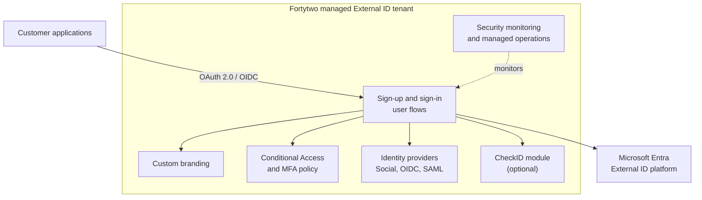
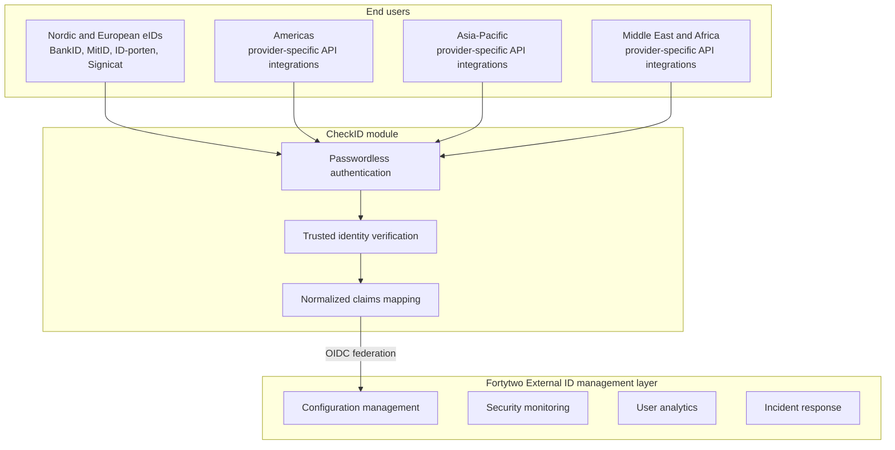

# Fortytwo Managed Microsoft Entra External ID

Fortytwo's Managed External ID service provides a production-ready, enterprise-grade implementation of Microsoft Entra External ID for customer identity and access management (CIAM), delivered as a fully managed service. This eliminates the complexity of tenant configuration, security hardening, and operational management while providing enhanced functionality and professional support.

## Prerequisites

- Azure subscription with appropriate permissions
- HTTPS-enabled customer-facing applications
- Brand assets for custom sign-in experiences
- Email/SMS provider (Azure Communication Services or custom)
- Basic understanding of OAuth 2.0 and OpenID Connect

## Service Overview

### What We Provide

- **Fully Managed External Tenant**: Complete External ID tenant setup and configuration
- **Multiple Authentication Methods**: Email/password, one-time passcodes, social providers (Google, Facebook, Apple), custom OIDC/SAML
- **CheckID Passwordless Module**: Optional integration with trusted Nordic/European eIDs and payment identity providers, plus provider-specific API integrations where available
- **Production-Ready Infrastructure**: Security-hardened, monitored, enterprise-grade configuration
- **Custom Branding**: Tailored sign-up/sign-in experiences matching your brand
- **API & Partner Portal**: Support for B2B API partners and developer ecosystem
- **Conditional Access Policies**: Adaptive access controls for MFA, location-aware access, and session management
- **Professional Support**: Implementation guidance, ongoing management, and 24/7 monitoring
- **Compliance Ready**: GDPR, SOC 2, ISO 27001 aligned configurations

### Business Benefits

| Benefit | Self-Managed Approach | Fortytwo Managed Service |
|---------|----------------------|--------------------------|
| Time to Production | 4-8 months | 6-8 weeks |
| Configuration Complexity | High - 100+ settings | Low - Managed for you |
| Security Hardening | DIY security reviews | Enterprise-grade defaults |
| Operational Management | 24/7 internal team needed | Fully managed |
| Support Model | Microsoft standard support | Fortytwo professional support |
| Cost Predictability | Variable + internal staffing | Fixed monthly + usage |
| Compliance Configuration | Self-certification | Pre-configured compliance |

## Architecture

### Managed External ID Deployment

### CheckID Integration Architecture

### External ID Control Boundary

Microsoft Entra External ID owns customer authentication, user flows, directory objects, token issuance, and federation with supported identity providers. Application teams still own authorization decisions, tenant modeling, data access rules, and legacy protocol edge cases.

Fortytwo designs this boundary during the initial workshop so the External ID tenant stays native where possible, and extension patterns are added only where the application architecture requires them.

| Layer | Primary Responsibility | Common Implementation |
|-------|------------------------|-----------------------|
| Sign-in and token issuance | External ID authenticates users and issues JWTs | User flows, custom branding, MFA, passkeys/FIDO2, OIDC/SAML federation |
| User lifecycle | External ID stores and manages customer accounts | Microsoft Graph, custom attributes, groups, application roles |
| Application authorization | Applications decide what a signed-in user can do | Claims, groups, app roles, OPA for ABAC, OpenFGA/Zanzibar-style relationship checks |
| Integration bridge | External systems enrich or validate flows | Custom authentication extensions, token enrichment APIs, CheckID, provider APIs |
| Fallback brokering | Handle confirmed blockers that cannot be met natively | Keycloak or similar broker only where External ID cannot cover the requirement |

## Core Services

### Identity Management
- **User Registration**: Self-service sign-up with email verification
- **Profile Management**: Customer self-service account management
- **Password Policies**: Enterprise-grade password requirements with custom banned password lists to block organization-specific strings during password creation and reset
- **Account Recovery**: Secure password reset flows
- **Just-in-Time Password Migration**: Migrate users from legacy systems on first sign-in without bulk data migration (Preview)

### Authentication Services
- **Multi-Factor Authentication**: Email one-time passcode, SMS, and passkeys/FIDO2 where supported by the selected flow
- **Social Login**: Google, Facebook, Apple, and additional providers through supported federation
- **Passwordless**: Email one-time passcodes and passkeys/FIDO2 where supported by the selected flow
- **Username & Alias Sign-in**: Users can sign in with a custom alias (customer ID, loyalty number, etc.) in addition to their email address, assignable via Graph API or admin center
- **Device Authorization Grant**: OAuth 2.0 device code flow for input-constrained devices such as smart TVs, IoT devices, and printers
- **CheckID Integration**: Nordic/European national eID verification plus provider-specific trusted identity verification where available (optional)
- **SSO**: Single sign-on across your application portfolio

### Security & Risk Management
- **Conditional Access**: MFA, location-aware, selected-app, device-platform, and session policies
- **Session Control**: Configurable sign-in frequency and persistent browser session policies via Conditional Access
- **WAF Integration**: Native protection via Akamai and Cloudflare Web Application Firewall integrations
- **Fraud Detection**: Bot and account-takeover protection through supported WAF and partner integrations
- **Threat Monitoring**: Authentication, audit, and provider telemetry monitoring with operational alerting
- **Audit Logging**: Comprehensive security event logging

### Developer Experience
- **API Partner Onboarding**: Self-service developer portal
- **OAuth 2.0 / OIDC**: Standard protocol support
- **Client Credentials (M2M)**: OAuth 2.0 client credentials flow for service-to-service integrations; requires M2M Premium add-on
- **Webhook Integration**: Real-time event notifications
- **Custom Claims**: Application-specific user attributes
- **Authorization Bridge**: Optional OPA or OpenFGA/Zanzibar-style integration when claims, groups, and application roles are not enough
- **Legacy Protocol Bridging**: Keycloak or another broker can be used for confirmed blockers, not as the default path

## CheckID Passwordless Module

### Overview
The CheckID module adds trusted, government-grade and payment-provider identity verification through integration with national electronic IDs, banking credentials, mobile payment systems, and custom API integrations in markets where provider APIs and local requirements support it.

### Supported Identity Providers

**Nordic Countries**:
- Norway: BankID, Vipps, ID-porten, MobilePay
- Sweden: BankID, MobilePay
- Denmark: MitID, NemID (legacy), MobilePay
- Finland: FTN (Finnish Trust Network), MobilePay
- Iceland: Íslykill (Audkenni)

**European Coverage (via Signicat)**:
- 35+ eID schemes across 44 countries
- Government-issued digital IDs
- Bank-issued identity credentials
- Belgium: itsme®
- Netherlands: iDIN, DigiD
- Germany: Verimi, eID card
- Austria: Handy-Signatur
- Estonia: eID card
- Czech Republic: Bank iD
- Poland: mObywatel
- And 35+ more across EU/EEA

**Global Coverage (via Custom API Integrations)**:
- **Asia-Pacific**: 
  - Singapore: SingPass
  - Japan: MyNumber
  - Australia: myGovID
  - India: Aadhaar (compliance-dependent)
  - Hong Kong: iAM Smart
  - Thailand: NDID
  - Custom integrations where provider APIs and local requirements support them
  
- **Americas**:
  - Canada: Government sign-in services
  - USA: Login.gov, ID.me, state-level eIDs
  - Brazil: Gov.br
  - Mexico: e.firma
  - Custom integrations where provider APIs and local requirements support them
  
- **Middle East & Africa**:
  - UAE: UAE Pass
  - Saudi Arabia: Absher, NAFATH
  - South Africa: Smart ID
  - Kenya: Huduma Namba
  - Custom integrations where provider APIs and local requirements support them

**Payment & Fintech Providers**:
- MobilePay (Nordic)
- Open Banking verification (22 EU countries)
- Bank verification APIs (global)
- Custom payment provider integrations

### CheckID Features

**Passwordless Authentication**:
- Zero password management
- Bank-grade security
- Instant verification
- Reduced friction
- Global coverage via API integrations

**Self-Service Onboarding**:
- Verify identity in seconds
- No manual document checks
- Automatic account provisioning
- Compliance-ready verification
- Works in supported markets where the required provider integration is available

**Account Recovery**:
- Re-verify with trusted eID or payment provider
- No helpdesk involvement
- Instant access restoration
- Audit trail maintained

**Custom API Integration Process**:
- Fortytwo builds and maintains integrations
- You specify required markets/providers
- Standardized OIDC/OAuth interface
- One integration point for all providers
- Ongoing maintenance included

### CheckID Use Cases

**1. Nordic B2C Applications**
Enable Norwegian, Swedish, Danish, and Finnish customers to sign in with BankID, Vipps, MobilePay, or their trusted banking credentials.

**2. European Market Expansion**
Support customers across 44 European countries with their national eID schemes and payment verification.

**3. Global Customer Base**
Serve customers across selected global markets with locally trusted identity methods through Fortytwo's custom API integrations.

**4. High-Value Transactions**
Step-up authentication for sensitive operations using verified government IDs or payment provider credentials.

**5. Regulatory Compliance**
Support AML/KYC workflows with bank-grade identity verification and payment provider authentication where the selected provider and jurisdiction allow it.

**6. Employee/Contractor Onboarding**
Passwordless workforce authentication for operations in any country where you have staff.

### CheckID Integration Options

**Standard Integration** (Included in CheckID Module):
- Pre-configured OIDC federation
- BankID, Vipps, MobilePay, ID-porten support
- Standard user flows
- Basic monitoring
- Up to 3 Nordic countries

**Premium Integration**:
- Full Signicat eID Hub access (35+ eIDs)
- MobilePay across all Nordic markets
- Custom claim mapping
- Advanced fraud detection
- White-label frontend
- Up to 10 European countries

**Enterprise Integration**:
- **Custom API integration portfolio**
- Fortytwo builds and maintains all integrations
- Identity providers in supported markets
- Dedicated CheckID instance
- Custom compliance configurations
- Priority support
- Full white-label options

**Custom API Integration Delivery**:
- Standard providers: 2-4 weeks per integration
- Complex providers: 4-8 weeks per integration
- Ongoing maintenance included in monthly fee
- Updates and upgrades managed by Fortytwo
- SLA-backed availability

### Global Integration Examples

**Manufacturing Company (60+ countries)**:
- Europe: Signicat eID Hub
- Asia: SingPass (Singapore), MyNumber (Japan), custom India integration
- Americas: Login.gov (USA), Gov.br (Brazil)
- Middle East: UAE Pass, NAFATH (Saudi Arabia)
- **Result**: Single authentication flow, locally-trusted verification worldwide

**Financial Services (Regulated Markets)**:
- Nordic: BankID, MobilePay for payments
- EU: Open Banking verification + national eIDs
- USA: Login.gov + bank account verification
- Compliance with local KYC/AML in each market

**IoT/Connected Devices (Global Consumer)**:
- Local payment verification (MobilePay, Apple Pay, Google Pay)
- Government ID fallback for each market
- Device association with verified identity
- Cross-border identity portability

## Supported Use Cases

### 1. Consumer Applications
**Scenario**: E-commerce, SaaS, mobile apps requiring customer authentication

**Features**:
- Fast social login (Google, Facebook, Apple)
- Email/password with MFA
- CheckID for Nordic/European users with BankID/MobilePay (optional)
- CheckID for global markets with local trusted providers (optional)
- Custom branded experiences
- Progressive profiling

**Claims**: Email, name, preferences, subscription status, custom attributes

### 2. B2B Customer Portal
**Scenario**: Business customers accessing services and dashboards

**Features**:
- Enterprise SSO integration
- CheckID for verified business identity globally (optional)
- Multi-tenant support
- Role-based access control
- Company-wide invitations

**Claims**: Company ID, role, permissions, business metadata

### 3. API Partner Ecosystem
**Scenario**: Third-party developers building integrations

**Features**:
- Developer self-registration
- API key management
- OAuth consent flows
- Rate limiting policies

**Claims**: Developer ID, API scopes, organization, tier level

### 4. IoT & Connected Devices
**Scenario**: Mobile apps controlling connected equipment

**Features**:
- Device registration
- Certificate-based auth
- MobilePay/payment verification for device setup
- Offline capability
- Equipment associations

**Claims**: Device IDs, serial numbers, ownership, location

### 5. Multi-Brand Organizations
**Scenario**: Multiple customer-facing brands under one company

**Features**:
- Separate tenant per brand
- Shared identity across brands
- Cross-brand analytics
- Centralized management

**Claims**: Brand affiliation, cross-brand loyalty, preferences

## Custom Branding Options

### Standard Branding (Included)
- **Logo Upload**: Your company logo on sign-in pages
- **Color Scheme**: Primary and accent colors
- **Basic Customization**: Standard layouts and templates
- **Email Templates**: Branded verification and notification emails

### Advanced Branding (Premium)
- **Custom Domain**: login.yourcompany.com
- **Full CSS Control**: Complete UI customization
- **Custom Layouts**: Unique page designs
- **Per-App Branding Themes**: Create distinct branding experiences per application with Live Preview in the admin center
- **Multi-language**: Support for 20+ languages
- **White-Label**: Complete brand immersion

### Branding Elements

**Sign-in Experience**:
- Background images or colors
- Custom headers and footers
- Terms of service and privacy policy links
- Help and support information
- CheckID branding integration (if module enabled)
- Localized provider names (BankID, MobilePay, local eIDs)

**Email Communications**:
- Verification emails
- Password reset notifications
- Security alerts
- Marketing opt-in confirmations

## Implementation Guide

### Design Workshops

The managed build starts with focused design workshops before tenant configuration. The goal is to make the identity model explicit, capture the decisions that affect application integration, and avoid rebuilding B2C custom-policy behavior by accident.

**Workshop Outputs**:
- Journey and UX flow map for sign-up, sign-in, reset, consent, and step-up flows
- Claims, groups, application roles, and authorization pattern decisions
- Identity provider and CheckID/eID integration backlog
- Conditional Access, MFA, session, and threat-monitoring baseline
- App inventory, redirect URI inventory, and API integration backlog
- Pilot, rollback, cutover, and support plan

### 6-8 Week Deployment Program

**Week 0: Kickoff**
- Access setup
- Application inventory
- Success measures and launch criteria
- Existing identity and claims review

**Week 1: Discovery & Design**
- Requirements gathering and use case analysis
- Identity provider selection (social, enterprise, custom, CheckID)
- Geographic coverage assessment
- Global integration requirements (which markets need custom APIs)
- User flow design and journey mapping
- Security and compliance requirements
- Brand asset collection
- CheckID module assessment (if requested)

**Weeks 2-3: Tenant Configuration**
- External ID tenant provisioning
- Identity provider integration
- CheckID module integration (if selected)
- Initial custom API integrations (priority markets)
- Custom branding implementation
- User attribute schema design
- Security policy configuration

**Weeks 4-5: Application Integration**
- SDK integration guidance
- API endpoint configuration
- CheckID authentication flows (if enabled)
- Global provider testing
- Test environment setup
- Developer documentation
- QA and security testing

**Weeks 6-8: Go-Live Preparation**
- Production deployment
- Security review and penetration testing
- Performance testing and optimization
- User acceptance testing
- Documentation and training delivery
- Post-launch monitoring setup

**Post-Launch: Ongoing Custom Integrations**
- Additional markets as you expand
- New provider integrations on-demand
- Continuous updates and maintenance
- Performance optimization

### Post-Launch Support
- 30-day hyper-care period
- Weekly check-ins
- Performance monitoring
- User feedback analysis
- Optimization recommendations
- New market integration planning

## Migrating from Azure AD B2C

Effective May 1, 2025, Azure AD B2C is no longer available to purchase for new customers. Existing Azure AD B2C customers can continue using the service, and Microsoft has stated support continues until at least May 2030. Microsoft Entra External ID is the natural next platform for new CIAM work and planned modernization. Fortytwo handles the full migration as a managed engagement.

Migration is not a lift-and-shift exercise. B2C custom policies, TrustFramework XML, claims transformations, and per-application journeys need to be assessed and rebuilt against the External ID model. The aim is to keep what maps cleanly to native External ID and add bridge patterns only for confirmed gaps.

### Migration Readiness Assessment

Before scoping a migration, Fortytwo runs the **Fortytwo B2C Migration Readiness Tool** against your existing B2C tenant. The tool is available as a CLI, a web UI, and a GitHub Actions workflow, so it fits into your existing processes without requiring manual access to be handed over.

It connects read-only to your B2C tenant and produces a structured readiness report covering:

- Custom policy (IEF) complexity and any constructs with no direct External ID equivalent
- User flows inventory and mapping to External ID counterparts
- Registered applications and their redirect/auth configurations
- Identity providers (social, SAML, OIDC federations)
- Custom claims and REST API connectors
- User volume and attribute schema
- Estimated migration complexity tier (simple / standard / complex / enterprise)

The report is the starting point for the scoped proposal and defines the migration phases, timeline, and whether JIT password migration is required.

For most customers, the first step is a focused 5-day gap assessment:

- Audit the current B2C tenant, custom policies, app registrations, claims, and identity providers
- Classify each flow as native External ID, External ID with extension, or blocker
- Identify authorization requirements that belong in the application layer rather than the identity provider
- Decide whether OPA, OpenFGA/Zanzibar-style relationship authorization, or a lightweight claims bridge is needed
- Use Keycloak or another broker only for confirmed External ID blockers such as legacy protocol or complex federation requirements
- Produce the migration backlog, coexistence plan, and 6-8 week build path

### What Fortytwo Handles

We own the end-to-end migration: assessment, configuration of the new External ID tenant, user and credential migration, application re-integration, and post-cutover support. Your team is not expected to operate the migration tooling or manage the Microsoft Graph scripting involved.

### Migration Phases

| Phase | What We Do |
|-------|------------|
| Assessment & inventory | Map existing B2C tenant: user flows, custom policies (IEF), identity providers, apps, claims, branding, compliance requirements |
| Gap classification | Decide what maps to native External ID, what needs custom authentication extensions, and what needs an authorization or federation bridge |
| External ID tenant setup | Provision and harden the External ID tenant, configure identity providers, user flows, Conditional Access, and branding |
| User data migration | Bulk-export users from B2C via Microsoft Graph and re-import into External ID with all relevant attributes and custom extension properties |
| Password migration | Choose the right strategy for your situation (see below) and implement it; we build and operate the migration infrastructure |
| Application re-integration | Update app registrations, OAuth/OIDC endpoints, claims handling, authorization checks, and redirect URIs; test all authentication flows against the new tenant |
| Cutover & decommission | Route live traffic to External ID, monitor authentication logs and error rates, then decommission the B2C tenant |

### Password Migration Strategy

The right approach depends on whether your B2C configuration stores passwords in a way that is accessible at runtime.

**Just-in-Time (JIT) migration** — recommended for most B2C migrations

Users continue signing in with their existing credentials without any interruption. On first sign-in after cutover, Fortytwo's custom authentication extension validates the entered password against the legacy system, migrates it into External ID, and clears the migration flag. Subsequent sign-ins go directly to External ID. Users never notice the migration.

This approach requires Fortytwo to build and host an Azure Function that connects to the legacy credential store, secured via Azure Key Vault and managed identity. It is the default recommendation because it requires no user action and no forced password reset.

**Self-service password reset (SSPR)** — simpler, user-facing

Users are prompted to reset their password on first sign-in after cutover. Suitable for smaller user bases or where the legacy password store is not accessible at runtime. Requires user communication before cutover.

### Work Estimates

Estimates are for the migration engagement on top of standard onboarding. Actual effort depends on the complexity of existing B2C custom policies and number of applications.

| Scenario | Estimated Effort |
|----------|-----------------|
| Simple B2C tenant: email/password + 1-2 apps, no IEF custom policies | 2-3 weeks |
| Standard B2C tenant: social providers + 3-5 apps, limited IEF customization | 4-6 weeks |
| Complex B2C tenant: IEF custom policies, multiple user journeys, 5+ apps, custom claims | 8-12 weeks |
| Enterprise B2C tenant: IEF, SAML integrations, custom REST APIs, compliance requirements | 12+ weeks, scoped separately |

JIT password migration adds approximately 1-2 weeks to any tier above, covering Azure Function development, Key Vault setup, testing, and cutover validation.

### Getting Started

Contact us at [external-id@fortytwo.io](mailto:external-id@fortytwo.io) to schedule a B2C migration assessment. We will review your existing tenant, identify any feature gaps or custom policy complexity, and provide a scoped proposal.

## Security & Compliance

### Security Features

**Security Monitoring**:
- Authentication and audit telemetry monitoring
- Suspicious activity alerts
- Provider health and error-rate monitoring
- Incident response runbooks
- CheckID verified identity assurance in supported markets (optional)

**Access Controls**:
- Conditional Access policies
- Location-based restrictions
- MFA enforcement
- Step-up authentication with CheckID (optional)
- Geographic policy enforcement
- Session controls for sign-in frequency and persistent browser sessions

**Data Protection**:
- Encryption at rest and in transit
- PII data minimization
- GDPR-compliant data handling
- Right to be forgotten support
- Regional data residency options

### Compliance Standards

**Compliance Alignment**:
- SOC 2-aligned controls
- ISO 27001-aligned controls
- GDPR-compliant data handling patterns
- HIPAA-supporting architecture where a BAA is in place
- PCI-conscious payment flow design
- eIDAS-supporting identity verification with eligible CheckID providers
- Regional compliance support (PDPA, LGPD, etc.)

**Data Residency**:
- EU data centers available
- Nordic data centers available (Norway)
- US data centers available
- Asia-Pacific data centers available (including Australia and Japan Go-Local options)
- Middle East data centers available
- Custom geographic requirements supported

### Audit & Logging

**What We Monitor**:
- All authentication attempts
- CheckID verification events globally (if enabled)
- Configuration changes
- Security policy violations
- Administrative actions
- API usage patterns
- Geographic access patterns

**What We DON'T Store**:
- Passwords (hashed only)
- Payment information
- Unnecessary PII
- Application data
- Provider credentials

**Retention Policies**:
- Security logs: 90 days standard, custom retention available
- Audit logs: 1 year
- User activity: Configurable per compliance requirements

## Monitoring & Operations

### Service Monitoring

**Health Checks**:
- Authentication endpoint availability
- Identity provider connectivity
- CheckID module availability globally (if enabled)
- MobilePay integration status
- Custom API integration health
- Email/SMS delivery rates
- API response times
- Error rates and anomalies

**Alerting**:
- Proactive incident detection
- Provider-specific alerts
- Geographic availability monitoring
- Automatic escalation
- Status page updates
- Customer notifications

### Performance Metrics

**Key Performance Indicators**:
- Authentication success rate (target: >99.5%)
- Sign-in latency (target: <500ms p95)
- CheckID verification success rate globally (target: >99% if enabled)
- MobilePay authentication success rate (target: >99%)
- Custom API integration uptime (target: >99.9%)
- Registration completion rate
- MFA enrollment rate
- Support ticket volume

## Support & SLA

### Service Level Agreement

| Metric | Standard | Premium | Enterprise |
|--------|----------|---------|------------|
| Uptime | 99.9% | 99.95% | 99.99% |
| Authentication Latency | <500ms (p95) | <300ms (p95) | <200ms (p95) |
| Support Response | <4 hours | <2 hours | <1 hour |
| Critical Issue Resolution | <24 hours | <12 hours | <4 hours |
| Monthly Active Users | Up to 100K | Up to 500K | Unlimited |
| Custom API Integrations | 3 included | 10 included | Unlimited |

### Support Tiers

**Standard Support (Included)**:
- Email support (business hours)
- Configuration assistance
- Integration documentation
- Monthly service reviews
- Security patch management
- CheckID module support (if enabled)
- Up to 3 custom API integrations

**Premium Support**:
- 24/7 email & phone support
- Dedicated Slack channel
- Quarterly business reviews
- Priority feature requests
- Custom integration consulting
- CheckID optimization guidance
- Up to 10 custom API integrations
- MobilePay integration support

**Enterprise Support**:
- 24/7 phone & video support
- Dedicated technical account manager
- Weekly operations reviews
- Custom SLA agreements
- Direct access to engineering team
- Custom development services
- Priority CheckID feature requests
- **Unlimited custom API integrations**
- Global provider relationship management

## Pricing Model

### Base Service

**Setup Fee**: One-time implementation (8-week program)
- €13,800 / 145,000 NOK (Standard)
- €23,000 / 241,500 NOK (Growth)
- Custom (Enterprise)

**Monthly Active Users**: Tiered pricing model
- First 50K MAU: Included in base fee
- 50K - 100K MAU: €0.018/user (0.19 NOK/user)
- 100K - 500K MAU: €0.014/user (0.15 NOK/user)
- 500K+ MAU: Custom pricing

**Management Fee**: Monthly operational management
- Standard: €2,300/month (24,150 NOK/month)
- Premium: €4,600/month (48,300 NOK/month)
- Enterprise: Custom

### CheckID Passwordless Module

**Module Setup**: One-time integration
- Standard Integration (Nordic): €4,600 / 48,300 NOK
- Premium Integration (Nordic + Full EU Signicat): €9,200 / 96,600 NOK
- Enterprise Integration (Global Unlimited): €18,400 / 193,200 NOK

**Monthly License**: Per-user pricing
- First 10K MAU: €0.05/user (0.53 NOK/user)
- 10K - 50K MAU: €0.04/user (0.42 NOK/user)
- 50K+ MAU: €0.03/user (0.32 NOK/user)

**Custom API Integration Fees** (Enterprise Package):
- Setup per new market/provider: €2,300-4,600 (24,150-48,300 NOK)
- Monthly maintenance per integration: €460 (4,830 NOK)
- Unlimited integrations: Flat fee €4,600/month (48,300 NOK)

**eID Provider Costs**: Pass-through billing
- Nordic eIDs (BankID, Vipps, MobilePay): ~€0.10-0.30 per authentication (1-3 NOK)
- Signicat eID Hub: €0.15-0.50 per authentication (1.5-5 NOK)
- Global custom APIs: €0.20-0.80 per authentication (2-8 NOK) depending on provider
- Volume discounts available

### Optional Add-Ons

- **Premium Branding**: €6,900 setup + €460/month (72,450 NOK + 4,830 NOK/month)
- **Additional Environments**: €920/month per environment (9,660 NOK/month)
- **Enhanced Monitoring**: €1,380/month (14,490 NOK/month)
- **Migration Services**: €230/hour (2,415 NOK/hour)
- **Custom Integrations**: €230/hour (2,415 NOK/hour)
- **Professional Services**: €230/hour (2,415 NOK/hour)
- **Express Custom API Integration**: €6,900 (72,450 NOK) for 2-week delivery

### Package Examples

**Startup Package** (Up to 50K MAU):
- Setup: €13,800 (145,000 NOK)
- Monthly: €2,300 (24,150 NOK)
- Includes: Standard support, basic branding, 2 environments
- **With CheckID Nordic**: Add €4,600 setup (48,300 NOK) + €0.05/user monthly (0.53 NOK/user)

**Growth Package** (Up to 250K MAU):
- Setup: €23,000 (241,500 NOK)
- Monthly: €4,600 + usage (48,300 NOK + usage)
- Includes: Premium support, advanced branding, 3 environments
- **With CheckID Premium EU**: Add €9,200 setup (96,600 NOK) + €0.04/user monthly (0.42 NOK/user)

**Enterprise Package** (Unlimited MAU):
- Setup: Custom
- Monthly: Custom
- Includes: Enterprise support, white-label, unlimited environments
- **With CheckID Enterprise Global**: Add €18,400 setup (193,200 NOK) + unlimited custom API integrations + €0.03/user monthly (0.32 NOK/user)

### Example Total Cost Scenarios

**Scenario 1: Nordic SaaS with 30K MAU + MobilePay**
- Base monthly: €2,300 (24,150 NOK)
- Users: €0 (included in first 50K)
- CheckID Nordic (BankID, Vipps, MobilePay): 30K × €0.05 = €1,500 (15,750 NOK)
- **Total Monthly**: €3,800 (39,900 NOK)

**Scenario 2: European E-commerce with 150K MAU**
- Base monthly: €4,600 (48,300 NOK)
- Users: 100K × €0.014 = €1,400 (14,700 NOK)
- CheckID Premium (Full EU + MobilePay): 50K × €0.04 = €2,000 (21,000 NOK)
- **Total Monthly**: €8,000 (84,000 NOK)

**Scenario 3: Global Marketplace with 500K MAU (60 countries)**
- Base monthly: Custom (~€8,000 / 84,000 NOK)
- Users: 450K × €0.014 = €6,300 (66,150 NOK)
- CheckID Enterprise Global: 
  - Base: €0.03/user × 200K = €6,000 (63,000 NOK)
  - Unlimited integrations: €4,600 (48,300 NOK)
  - Custom APIs (10 markets): Included
- **Total Monthly**: ~€24,900 (261,450 NOK)

**Scenario 4: Manufacturing/Equipment (60 countries, employee + customer)**
- Base monthly: Custom (~€10,000 / 105,000 NOK)
- Employees (60K): €0.014 × 10K = €140 (1,470 NOK)
- Customers (200K): €0.014 × 150K = €2,100 (22,050 NOK)
- CheckID Enterprise:
  - Unlimited global: €4,600 (48,300 NOK)
  - 15 custom API integrations for key markets
- **Total Monthly**: ~€16,840 (176,820 NOK)

---

## Getting Started

**Ready to simplify your customer identity management globally?**

Contact: [external-id@fortytwo.io](mailto:external-id@fortytwo.io)  
Schedule a demo: [fortytwo.io/book-a-demo](https://www.fortytwo.io/book-a-demo)  
Technical documentation: [docs.fortytwo.io/external-id](https://docs.fortytwo.io/external-id)  
CheckID module info: [docs.checkid.no](https://docs.checkid.no)

**Next Steps**:
1. Schedule discovery call
2. Identify required geographic markets and providers
3. Receive custom proposal with CheckID assessment
4. Review architecture design
5. Sign MSA and SOW
6. Kick off 8-week implementation
7. Ongoing custom API integrations as you expand

---

*All prices exclude VAT. Norwegian customers subject to 25% MVA. EU customers subject to local VAT rates. Volume discounts available for enterprise deployments. CheckID module requires separate terms with identity provider partners. Custom API integration pricing varies by provider complexity and market requirements. Contact us for detailed pricing based on your specific geographic coverage needs.*
