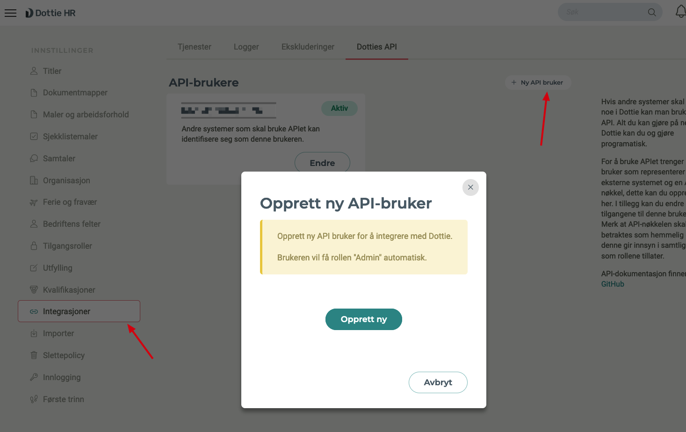
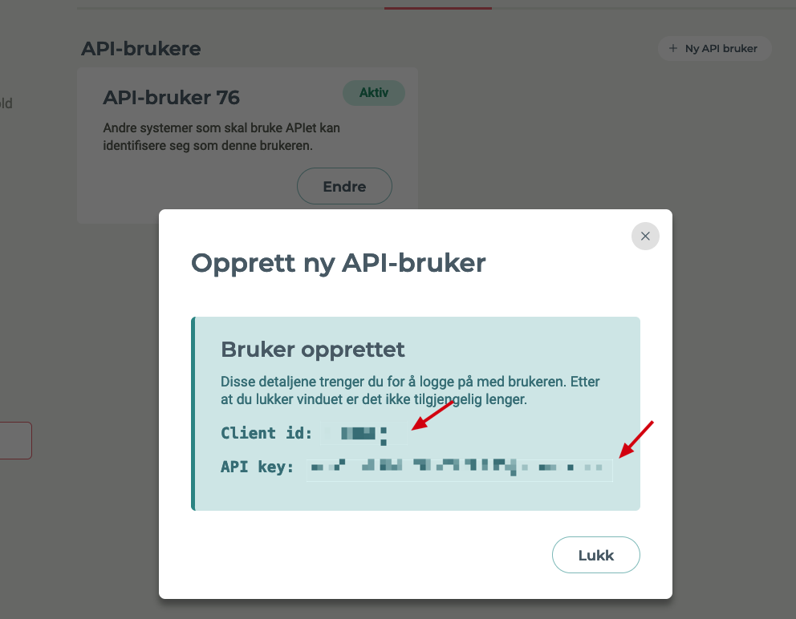
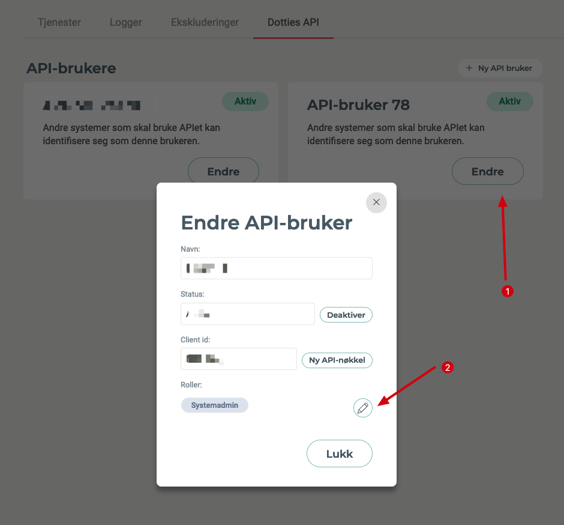

# Dottie

## Required HR configuration

In order for Fortytwo to connect to the HR system, we require a **Client ID** and **Client secret** configured under API access, to access [this API](https://api.dottie.no/swagger/index.html). Please provide this to your Fortytwo contact during the initial phase of implementation.

## How to create Client ID and Secret in Dottie

1. Go to Settings -> Integrations on [this url](https://app.dottie.no/settings/integrations/api)
2. Click "New API User".


3. Click "Create new".
4. Take a note of "Client ID" and "API Key" and click "Close".


5. Now, Edit the user you just created. (You might need to refresh the browser to see it)


6. Add the role "Toppleder/Top Leader". and click "Close" and "Close".


7. Done. Give the keys to your Fortytwo contact person.

## Schema used for attribute mapping

The service sendes each employee as a standard SCIM representation to the Entra ID Inbound Provisioning API. The below is a full example of the payload we send, and can be used to define attribute mapping in the customer tenant:

```JSON
{
  "displayName": "Alma Nakken",
  "urn:ietf:params:scim:schemas:extension:enterprise:2.0:User": {
    "department": null,
    "manager": {
      "value": "2"
    },
    "employeeNumber": "1",
    "organization": "Company Inc",
    "division": "HR"
  },
  "urn:ietf:params:scim:schemas:extension:fortytwo:1.0:User": {
    "enddate": null,
    "jobtitleid": 17,
    "orglevel0id": "197",
    "orglevel0name": "Company Inc",
    "orglevel1id": "187",
    "orglevel1name": "HR",
    "orglevel2id": null,
    "orglevel2name": null,
    "orglevel3id": null,
    "orglevel3name": null,
    "orglevel4id": null,
    "orglevel4name": null,
    "orglevelids": [
      "197",
      "187"
    ],
    "raw": null,
    "ssn": null,
    "startdate": null
  },
  "name": {
    "familyName": "Nakken",
    "givenName": "Alma"
  },
  "phoneNumbers": [
    {
      "type": "mobile",
      "value": "+4799999999"
    }
  ],
  "externalid": "1",
  "active": true,
  "schemas": [
    "urn:ietf:params:scim:schemas:core:2.0:User",
    "urn:ietf:params:scim:schemas:extension:enterprise:2.0:User",
    "urn:ietf:params:scim:schemas:extension:fortytwo:1.0:User"
  ],
  "title": "HR Consultant",
  "addresses": [
    {
      "primary": true,
      "type": "work",
      "region": "Oslo",
      "postalCode": "0862",
      "locality": "Oslo",
      "streetAddress": "Folke bernadottes vei 9A",
      "country": "NOR"
    }
  ]
}
```

| SCIM attribute                                                            | HR source object              | HR source attribute                                           |
|---------------------------------------------------------------------------|-------------------------------|---------------------------------------------------------------|
| externalid                                                                | Employee                      | employeeNumber                                                |
| displayName                                                               | Employee                      | firstname + lastname                                          |
| title                                                                     | Employee, JobTitle            | jobTitleId used to look in JobTitle                           |
| name.familyName                                                           | Employee                      | lastname                                                      |
| name.givenName                                                            | Employee                      | firstName                                                     |
| phoneNumbers[type eq "mobile"].value                                      | EmployeePhone                 | phoneNumber of kind 1                                         |
| phoneNumbers[type eq "work"].value                                        | EmployeePhone                 | phoneNumber of kind 0                                         |
| active                                                                    | Employee                      | firstDayOfWork, lastDayOfWork                                 |
| urn:ietf:params:scim:schemas:extension:enterprise:2.0:User:employeeNumber | Employee                      | employeeNumber                                                |
| urn:ietf:params:scim:schemas:extension:enterprise:2.0:User:manager        | Employee                      | employeeid of leaderId                                        |
| urn:ietf:params:scim:schemas:extension:enterprise:2.0:User:organization   | Employee, OrganizationUnit    | organizationUnitId used to get level 1 of org structure       |
| urn:ietf:params:scim:schemas:extension:enterprise:2.0:User:division       | Employee, OrganizationUnit    | organizationUnitId used to get level 2 of org structure       |
| urn:ietf:params:scim:schemas:extension:enterprise:2.0:User:department     | Employee, OrganizationUnit    | organizationUnitId used to get level 3 of org structure       |
| urn:ietf:params:scim:schemas:extension:fortytwo:1.0:User:startdate        | Employee                      | firstDayOfWork                                                |
| urn:ietf:params:scim:schemas:extension:fortytwo:1.0:User:enddate          | Employee                      | lastDayOfWork                                                 |
| urn:ietf:params:scim:schemas:extension:fortytwo:1.0:User:ssn              | UserProfile                   | nationalIdNumber                                              |
| urn:ietf:params:scim:schemas:extension:fortytwo:1.0:User:jobtitleid       | Employee                      | jobTitleId                                                    |
| urn:ietf:params:scim:schemas:extension:fortytwo:2.0:User:orglevel0name    | Employee, OrganizationUnit    | organizationUnitId used to get level 1 of org structure       |
| urn:ietf:params:scim:schemas:extension:fortytwo:2.0:User:orglevel1name    | Employee, OrganizationUnit    | organizationUnitId used to get level 2 of org structure       |
| urn:ietf:params:scim:schemas:extension:fortytwo:2.0:User:orglevel2name    | Employee, OrganizationUnit    | organizationUnitId used to get level 3 of org structure       |
| urn:ietf:params:scim:schemas:extension:fortytwo:2.0:User:orglevel3name    | Employee, OrganizationUnit    | organizationUnitId used to get level 4 of org structure       |
| urn:ietf:params:scim:schemas:extension:fortytwo:2.0:User:orglevel4name    | Employee, OrganizationUnit    | organizationUnitId used to get level 5 of org structure       |
| urn:ietf:params:scim:schemas:extension:fortytwo:2.0:User:orglevel0id      | Employee, OrganizationUnit    | organizationUnitId used to get level 1 of org structure       |
| urn:ietf:params:scim:schemas:extension:fortytwo:2.0:User:orglevel1id      | Employee, OrganizationUnit    | organizationUnitId used to get level 2 of org structure       |
| urn:ietf:params:scim:schemas:extension:fortytwo:2.0:User:orglevel2id      | Employee, OrganizationUnit    | organizationUnitId used to get level 3 of org structure       |
| urn:ietf:params:scim:schemas:extension:fortytwo:2.0:User:orglevel3id      | Employee, OrganizationUnit    | organizationUnitId used to get level 4 of org structure       |
| urn:ietf:params:scim:schemas:extension:fortytwo:2.0:User:orglevel4id      | Employee, OrganizationUnit    | organizationUnitId used to get level 5 of org structure       |
| urn:ietf:params:scim:schemas:extension:fortytwo:2.0:User:orglevelids      | Employee, OrganizationUnit    | organizationUnitId used to get all ids from the org structure |
