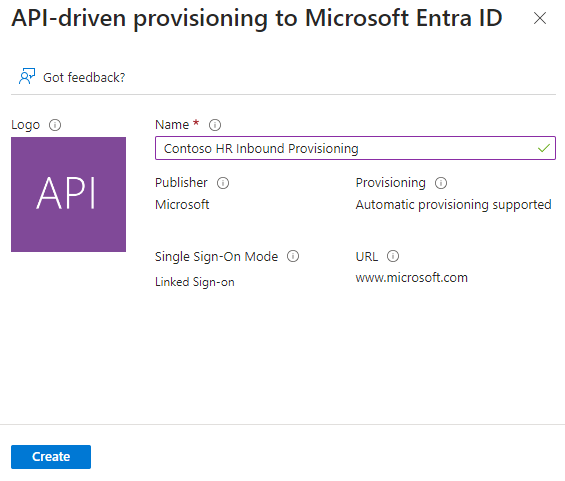
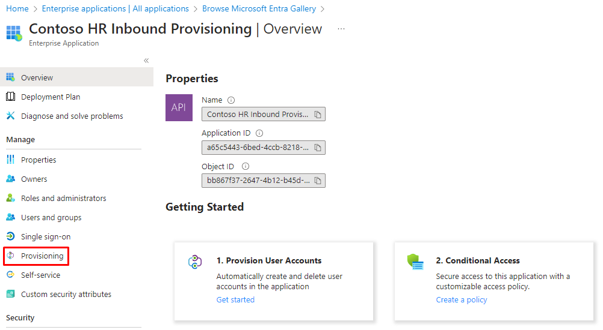
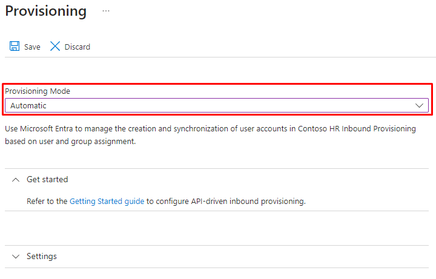

# Onboarding HR Provisioning

Thank you for your interest in our HR Provisioning service. In order to onboard to the service, the following steps are required:

| #       | Who?           | What?                                                       |
|---------|----------------|-------------------------------------------------------------|
| 1       | Customer       | Consent to [Fortytwo app for HR Provisioning](https://login.microsoftonline.com/common/adminconsent?client_id=ddf53ad4-f0fb-47a3-874f-ac7a733010b2) |
| 2       | Customer       | If using Active Directory, [Install the Microsoft Entra Provisioning Agent](https://learn.microsoft.com/en-us/entra/identity/hybrid/cloud-sync/how-to-install) |
| 3       | Customer       | Create Provisioning API instance |
| 4       | Fortytwo       | Read HR data and write to Entra ID Inbound Provisioning |
| 5       | Fortytwo       | Match user accounts and create report of creates and updates before go-live |
| 6       | Fortytwo       | Go-live of provisioning |
| Ongoing | Fortytwo       | Operations |

## Step 1 - Consent to Fortytwo app for HR Provisioning

Navigate to [this url](https://login.microsoftonline.com/common/adminconsent?client_id=ddf53ad4-f0fb-47a3-874f-ac7a733010b2) and sign in as a Global Administrator in order to consent to Fortytwo accessing your tenant. We need the following permissions:

| Scope                           | Why?                                                                                                                    |
|---------------------------------|-------------------------------------------------------------------------------------------------------------------------|
| AuditLog.Read.All               | Used to query the provisioning log for provisioning status. There is no less privileged graph scope for this available. |
| SynchronizationData-User.Upload | Required in order to send data to the inbound provisioning API.                                                         |
| User.Read.All                   | Required for user joining and determining the consequence of enabling synchronization.                                  |

## Step 2 - If using Active Directory, Install the Microsoft Entra Provisioning Agent

Follow the [Microsoft documentation](https://learn.microsoft.com/en-us/entra/identity/hybrid/cloud-sync/how-to-install) for installing the Microsoft Entra Provisioning Agent.

## Step 3 - Create Provisioning API instance

### Provisioning to Active Directory

### Provisioning to Entra ID (Cloud only)

1. Sign into the [Entra Portal](https://entra.microsoft.com/) as a Global Administrator
2. Under **Enterprise applications** click **New application**

3. Search for **API-Driven Provisioning** and select the one named **API-driven provisioning to Microsoft Entra ID**

4. Give the application a logical name, such as **Contoso HR Inbound Provisioning** and click **Create**

5. When the application has been created, go to **Provisioning** in the left menu and click **Get started**

6. Switch **Provisioning mode** to **Automatic** and click **Save**

7. Go back to the **Overview**, still under *Provisioning*.

