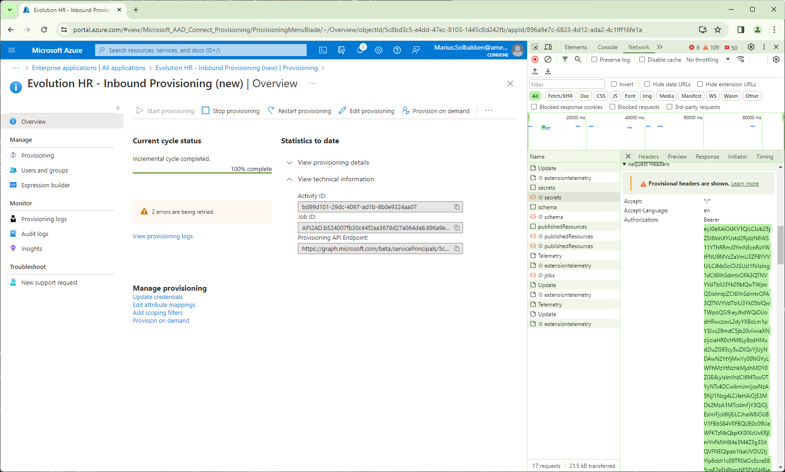

# Fully restarting sync

The Entra ID Inbound Provisioning API maintains a "sticky join", meaning it will statefully remember which Active Directory and Entra ID object has successfully been synced with a SCIM object.

This also means that a wrongly joined user can continue to be wrongly joined, even though an attribute is switched over to another user account.

The "Restart provisioning" button in the Entra ID portal does not clear this sticky join. Instead, the below steps must be done:

- Sign into the Entra ID tenant and find the Inbound Provisioning API
- Open a PowerShell
- Extract your Graph access token using developer mode and set the $accesstoken variable in PowerShell:



```PowerShell
$accesstoken = "ey....=="
```

- Find the provisioning API endpoint and copy it into the $api variable


```PowerShell
$api = "https://..../bulkUpload"
```

- Run the below PowerShell to restart sync fully:

    ```PowerShell
    Invoke-RestMethod -Uri ($uri -replace "/bulkUpload","/restart") -Method Post -Body '{"criteria":{"resetScope":"Full"}}' -ContentType "application/json" -Headers @{Authorization = "Bearer $accesstoken"}
    ```

- The API should now show the following:


All joins will now be re-evaluated on the next full sync cycle from the Fortytwo HR provisioning service, which will happen each night.