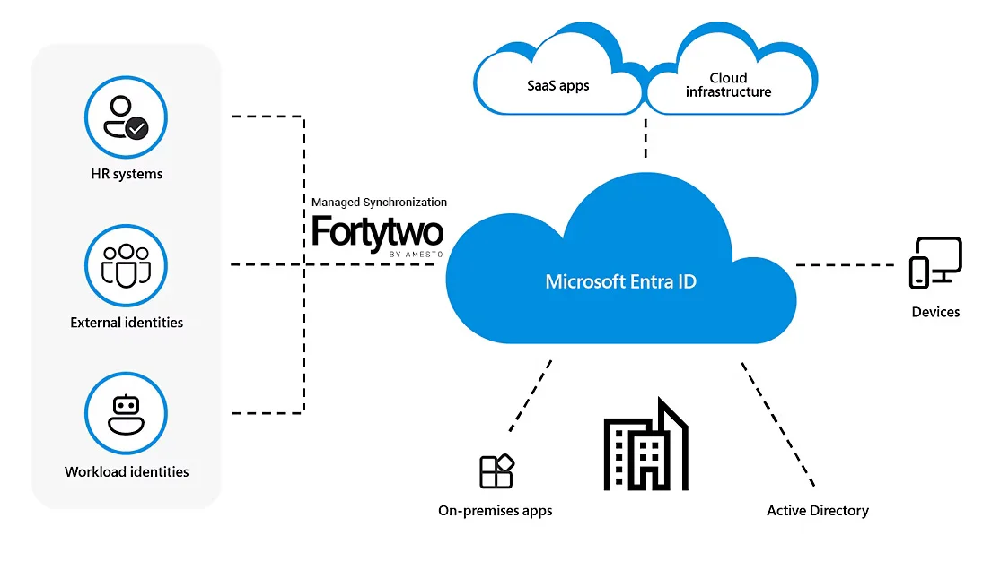

# Service description

At Fortytwo, we understand the critical importance of maintaining seamless integration between your Human Resources (HR) system and your identity platform with Active Directory and Entra ID, for efficient user account management. Our service, *Fortytwo HR Provisioning*, is designed to streamline and automate the synchronization of HR data with the identity platform through the [Entra ID Inbound Provisioning API](https://learn.microsoft.com/en-us/entra/identity/app-provisioning/inbound-provisioning-api-concepts). This ensures that your user accounts remain up-to-date and aligned with HR processes, facilitating a smooth joiner-mover-leaver lifecycle process.

## Key features

- **Data sync:** Fortytwo HR Provisioning ensures synchronization of employee data from your HR system to Active Directory and Entra ID, reducing manual efforts and minimizing the risk of discrepancies.
- **Seamless integration:** Our service seamlessly integrates with Entra ID, establishing a robust connection that guarantees the accuracy and consistency of user account information.
- **Automated Joiner-Mover-Leaver process:** Fortytwo HR Provisioning automates the entire joiner-mover-leaver process, linking HR events directly to the corresponding user accounts in Entra ID. This results in efficient onboarding, relocation, and offboarding procedures. The service can also be used in conjunction with Entra ID Lifecycle Workflows, in order to customize the onboarding workflow.
- **Customizable mapping:** Tailor the mapping of HR data fields to Active Directory and Entra ID attributes based on your organization's unique requirements. This flexibility ensures that the service adapts to your specific HR data model.
- **Audit trail and reporting:** Gain insights into the provisioning activities with a comprehensive audit trail. Detailed reports provide transparency and accountability, allowing you to track changes and ensure compliance.
- **Scalability and reliability:** Fortytwo HR Provisioning is designed to scale with your organization's growth. The service is built on a reliable infrastructure, ensuring continuous operation and data integrity.

## Benefits

- **Utilize Entra ID to the max:** Ensure that you can utilize the full potential of your already purchased licenses.
- **Efficiency:** Eliminate manual data entry and reduce the risk of errors by automating the provisioning process.
- **Reduced IT cost:** Eliminate manual processes for IT.
- **Compliance:** Ensure compliance with HR policies and regulations through accurate and timely updates to user accounts in Entra ID.
- **Enhanced security:** Fortytwo HR Provisioning prioritizes data security, employing industry-standard protocols to safeguard sensitive HR information during transmission and storage.
- **User experience:** Employees experience minimal disruption as their Entra ID accounts seamlessly reflect HR-related changes, fostering a positive user experience.

**Fortytwo HR Provisioning** empowers your organization with a reliable and efficient solution for maintaining synchronization between your HR system and Entra ID, enabling you to focus on strategic HR initiatives while ensuring data accuracy and compliance. Experience the next level of HR and identity management integration with Fortytwo.

## Responsibility matrix

| Task/Activity                          | Responsible |
|----------------------------------------|-------------|
| **Service Implementation**             |             |
| Configure service settings             | Fortytwo    |
| Establish HR system connection         | Fortytwo    |
| Define attribute mapping               | Shared      |
| Microsoft user licensing               | Customer    |
| **Ongoing Operations and Support**     |             |
| HR data quality                        | Customer    |
| Address data discrepancies             | Customer    |
| Monitor data synchronization           | Fortytwo    |
| Address service issues                 | Fortytwo    |
| Address API changes                    | Fortytwo    |
| **Configuration Changes**              |             |
| Update data mapping                    | Fortytwo    |
| Adjust service settings                | Fortytwo    |
| **Communication**                      |             |
| Provide service updates                | Fortytwo    |
| Share best practices                   | Fortytwo    |
| Report issues                          | Customer    |
| Inform end users about data processing | Customer    |

## Pricing

- **500 USD** per month, includes **300 users**
- **0.30 USD** per additional user

Billing can be done through [Azure Marketplace](https://azuremarketplace.microsoft.com/en-us/marketplace/apps/amestofortytwoas1653635920536.managed_identity_services?tab=PlansAndPrice) or directly.
