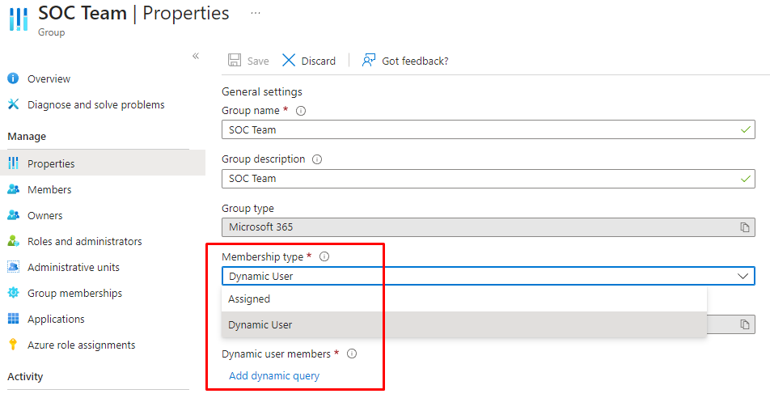

# Organizational structure as security groups

Through our "organizational structure as security groups"-service, we generate each element in the organizational hierarchy as groups in Entra ID, with the option of enabling write-back to on-premises Active Directory. These groups can either be granted permissions directly, such as permissions on a file share or assigned an enterprise app, or they can be added as member of other groups. Please note that there are very few features in Entra ID that supports nested groups. Instead of nested groups, what you can do is to use the feature [Group membership in a dynamic group in Microsoft Entra ID](https://learn.microsoft.com/en-us/entra/identity/users/groups-dynamic-rule-member-of).

This means that if you have an existing Team, where you want to dynamically add users, you can convert the team to criteria based membership by following these steps:

1. In the Entra or Azure portal, find the group and update the **Membership type** to **Dynamic user**, and click **Add dynamic query**



2. Edit the query and insert something like this, where the GUID values below are replaced with the object id of the groups you want to add:

**Add members from a single group**

```user.memberof -any (group.objectId -in ['0ec82ade-dc40-4ad9-bf0d-0993adc231aa'])```

**Add members from three different groups**

```user.memberof -any (group.objectId -in ['0ec82ade-dc40-4ad9-bf0d-0993adc231aa','c240c88b-6554-4158-92ee-fdef974c3dc4','c240c88b-6554-4158-92ee-fdef974c3dc4'])```

There are [quite a few limitations](https://learn.microsoft.com/en-us/entra/identity/users/groups-dynamic-rule-member-of#preview-limitations) to the feature currently. Most noteably it is not possible to use other operations, such as **-all** (in order to only add members that are a member of multiple groups) and it is not possible to combine with other filters, such as **user.jobTitle -ne 'Consultant'**.

If you want to add some manual users as well as the dynamic ones, you can create an additional group with the manual users and add the object id of that group to the filter. As an example, you can have the Team **HR Department**, where you have our dynamic group **org - Company - HR** as a memberof, but also the group **HR Department - Manual users**.

```user.memberof -any (group.objectId -in ['ObjectID of org - Company - HR','ObjectID of HR Department - Manual users'])```