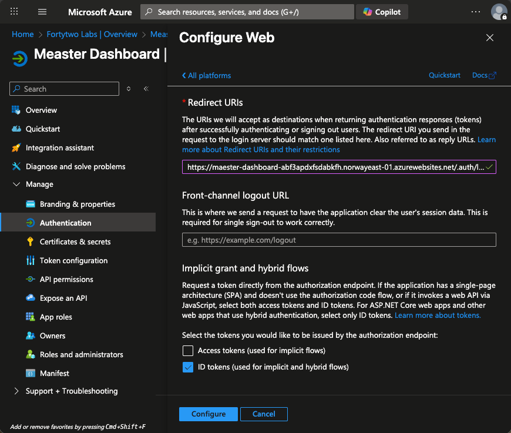

# Maester my Microsoft365

This is an easily deployable solution template on Microsoft Marketplace, that will make Maester run in your own environment, giving you control over the setup.

## How to install the solution

This will provide you with a step-by-step to have the solution running in your environment.

1. First find the solution in Microsoft Marketplace and start the wizard. Then fill in the required information about resource group and name.  
   
2. Then connect it to an App Registration in your tenant, that will be used for SSO. You can choose to use an existing, or create a new one.  
   
3. This example shows creating a new App Registration.  
   
4. This will bring you into the App Registration window, where you can create a new client secret.  
   
   
   
5. Press the x to go back to the Wizard, and paste the new client secret into the client secret box.  
   
6. If you need to tag the resources, you can do so.  
   
7. Now you can click 'Create' to deploy the app.  
   
   
8. When the deployment is done, you can go to 'Outputs' and copy the redirectUri.  
   
9. Then go back to the App Registration, under 'Authentication'.  
   
10. Then go to 'Add a platform', and choose 'Web'.  
    
11. Paste the redirect uri in the text field, and check the box for 'ID Tokens', and press 'Configure'.  
    
    
12. When you now open the webpage URL, you should be redirected to sign in to your organization, and then to approve the permissions requested to read your profile.  
    
13. After that, you should be signed in. You will now have to add some roles to the application to be able to read Tenant settings. There is a script to do that ready under "Help" in the menu. After that is done reports will be gathered once a day.  
    
