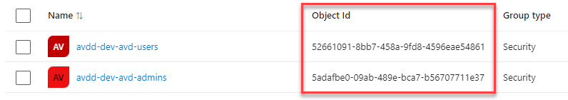
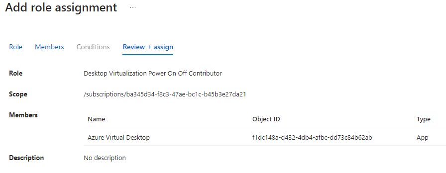

# Deployment

Managed Desktop Light is deployed through the Azure Portal, using Azure Marketplace. The deployment is done in a few steps, and is fully automated.
The resources is placed in a resource group, and the resource group is placed in a subscription that lives in your own tenant. The subscription is billed monthly, and the cost is based on the number of users.

## Decisions

There is a few descicions that needs to be made before the deployment can be started.

- The name of the resource group
- The name of the Managed Application
- The name of the Managed Resource Group
- Company name (ie. Contoso Ltd.)
- Environment name (ie. Visma Archive Solution)
- Does the environment have a need for the Office Suite?
- If the environment have the Office Suite, should it be published as a remoteApp?
- Should the solution be shutdown at a certain time of day? (cost saving)
- What size should the datadisk be? (default is 128GB)
- What SKU should the Virtual Machine have? (default is Standard_B2ms_v2 - which suites a simple application with a few users)

## Prerequisites

There is a few prerequisites that needs to be in place before the deployment can be started.

- ObjectID of the two groups that should grant access to the solution, from your own EntraID tenant.

The application "Azure Virtual Desktop" with ClientID 5a0aa725-4958-4b0c-80a9-34562e23f3b7 (Object ID is different in each tenant) needs to be granted the the permission "Desktop Virtualization Power On Off Contributor" on the **subscription**.
This is done in the Azure Portal, under "Subscriptions" -> "Access Control (IAM)" -> "Add role assignment". The role is "Desktop Virtualization Power On Off Contributor", and the assignee is "Azure Virtual Desktop".

**NB!** The role **must** be granted on the subscription level.

### EntraID (previously Azure AD)

The solution is based on Azure AD, and the users needs to be created in Azure AD. The users can be created in the Azure Portal, or synced from an on-prem AD using Azure AD Connect.
You need two groups in Azure AD, one for the users that should have access to the solution, and one for the users that should have admin access to the solution. The groups is used to grant access to the Virtual Machine (session host).

#### Admin group

The users in the admin group will be granted the following roles on the resource group:

- Virtual Machine Administrator Login ([description](https://learn.microsoft.com/en-us/azure/role-based-access-control/built-in-roles#virtual-machine-administrator-login))
- Backup Operator ([description](https://learn.microsoft.com/en-us/azure/role-based-access-control/built-in-roles#backup-operator))
- Desktop Virtualization User ([description](https://learn.microsoft.com/en-us/azure/role-based-access-control/built-in-roles#desktop-virtualization-user))

#### User group

The users in the user group will be granted the following roles on the resource group:

- Virtual Machine User Login ([description](https://learn.microsoft.com/en-us/azure/role-based-access-control/built-in-roles#virtual-machine-user-login))
- Desktop Virtualization User ([description](https://learn.microsoft.com/en-us/azure/role-based-access-control/built-in-roles#desktop-virtualization-user))
